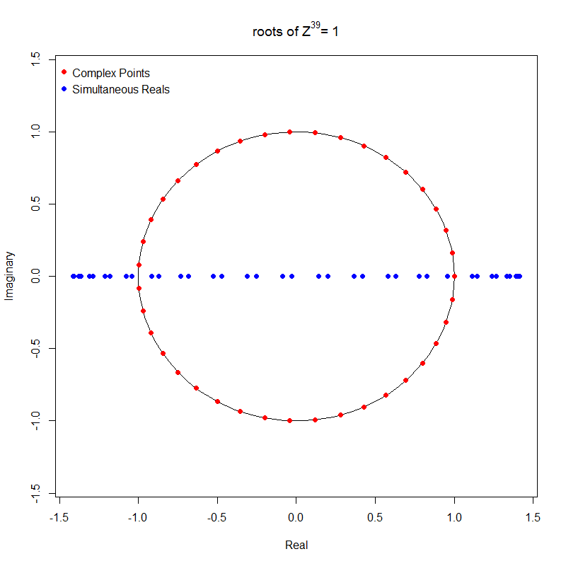

# Here are a few visualizations of the above R routines.

# Discrete Fourier Transform
Below is the output and image from the `DFT` R function, found in the `Roots_of_unity.R` file above.

It produces the identical complex number output from the standard `fft()` function in R, found in the `f hat` column.

```r
x=seq(0,1,.01);y=sin(x)
DFT(y)
```


```r
           Real 1        Real 2                  f hat Magnitude   Amplitude
1    46.390121824  46.390121824 46.3901218+ 0.0000000i   92.7802 0.918616274
2    12.303667079 -15.634741445 -1.6655372-13.9692043i   28.1363 0.278577113
3     6.113549355  -7.569917230 -0.7281839- 6.8417333i   13.7608 0.136245058
4     3.978796427  -5.095993953 -0.5585988- 4.5373952i    9.1433 0.090527731
5     2.891525025  -3.890589791 -0.4995324- 3.3910574i    6.8553 0.067874311
6     2.231091904  -3.175579531 -0.4722438- 2.7033357i    5.4885 0.054342054
7     1.786547471  -2.701415809 -0.4574342- 2.2439816i    4.5803 0.045349127
8     1.466334577  -2.363353442 -0.4485094- 1.9148440i    3.9333 0.038943947
9     1.224266796  -2.109705320 -0.4427193- 1.6669861i    3.4495 0.034153926
10    1.034515440  -1.912017221 -0.4387509- 1.4732663i    3.0744 0.030439811
11    0.881504004  -1.753330577 -0.4359133- 1.3174173i    2.7753 0.027478476
12    0.755279537  -1.622908639 -0.4338146- 1.1890941i    2.5315 0.025064487
13    0.649184314  -1.513622269 -0.4322190- 1.0814033i    2.3292 0.023060988
14    0.558595961  -1.420551752 -0.4309779- 0.9895739i    2.1587 0.021373285
15    0.480204602  -1.340192135 -0.4299938- 0.9101984i    2.0133 0.019933776
16    0.411577647  -1.269978545 -0.4292004- 0.8407781i    1.8880 0.018692910
17    0.350886999  -1.207990610 -0.4285518- 0.7794388i    1.7790 0.017613541
18    0.296732080  -1.152761804 -0.4280149- 0.7247469i    1.6834 0.016667279
19    0.248021598  -1.103152681 -0.4275655- 0.6755871i    1.5990 0.015832055
20    0.203892479  -1.058264353 -0.4271859- 0.6310784i    1.5241 0.015090457
21    0.163653029  -1.017378037 -0.4268625- 0.5905155i    1.4573 0.014428568
22    0.126742264  -0.979911960 -0.4265848- 0.5533271i    1.3973 0.013835131
23    0.092700295  -0.945390059 -0.4263449- 0.5190452i    1.3434 0.013300945
24    0.061146402  -0.913418886 -0.4261362- 0.4872826i    1.2947 0.012818421
25    0.031762574  -0.883670301 -0.4259539- 0.4577164i    1.2505 0.012381243
26    0.004280983  -0.855868337 -0.4257937- 0.4300747i    1.2104 0.011984116
27   -0.021525666  -0.829779098 -0.4256524- 0.4041267i    1.1739 0.011622571
28   -0.045851644  -0.805202919 -0.4255273- 0.3796756i    1.1406 0.011292808
29   -0.068864110  -0.781968196 -0.4254162- 0.3565520i    1.1102 0.010991584
30   -0.090707806  -0.759926504 -0.4253172- 0.3346093i    1.0823 0.010716112
31   -0.111508813  -0.738948684 -0.4252287- 0.3137199i    1.0569 0.010463987
32   -0.131377592  -0.718921697 -0.4251496- 0.2937721i    1.0335 0.010233127
33   -0.150411455  -0.699746053 -0.4250788- 0.2746673i    1.0122 0.010021721
34   -0.168696591  -0.681333717 -0.4250152- 0.2563186i    0.9926 0.009828190
35   -0.186309746  -0.663606376 -0.4249581- 0.2386483i    0.9748 0.009651152
36   -0.203319606  -0.646494002 -0.4249068- 0.2215872i    0.9584 0.009489399
37   -0.219787969  -0.629933648 -0.4248608- 0.2050728i    0.9435 0.009341868
38   -0.235770723  -0.613868443 -0.4248196- 0.1890489i    0.9300 0.009207626
39   -0.251318675  -0.598246730 -0.4247827- 0.1734640i    0.9177 0.009085854
40   -0.266478264  -0.583021342 -0.4247498- 0.1582715i    0.9066 0.008975831
41   -0.281292165  -0.568148974 -0.4247206- 0.1434284i    0.8966 0.008876927
42   -0.295799820  -0.553589648 -0.4246947- 0.1288949i    0.8876 0.008788589
43   -0.310037889  -0.539306238 -0.4246721- 0.1146342i    0.8797 0.008710336
44   -0.324040656  -0.525264064 -0.4246524- 0.1006117i    0.8728 0.008641752
45   -0.337840385  -0.511430530 -0.4246355- 0.0867951i    0.8668 0.008582477
46   -0.351467631  -0.497774797 -0.4246212- 0.0731536i    0.8618 0.008532209
47   -0.364951531  -0.484267496 -0.4246095- 0.0596580i    0.8576 0.008490694
48   -0.378320061  -0.470880463 -0.4246003- 0.0462802i    0.8542 0.008457723
49   -0.391600277  -0.457586495 -0.4245934- 0.0329931i    0.8517 0.008433135
50   -0.404818538  -0.444359126 -0.4245888- 0.0197703i    0.8501 0.008416809
51   -0.418000717  -0.431172409 -0.4245866- 0.0065858i    0.0000 0.000000000
52   -0.431172409  -0.418000717 -0.4245866+ 0.0065858i    0.0000 0.000000000
53   -0.444359126  -0.404818538 -0.4245888+ 0.0197703i    0.0000 0.000000000
54   -0.457586495  -0.391600277 -0.4245934+ 0.0329931i    0.0000 0.000000000
55   -0.470880463  -0.378320061 -0.4246003+ 0.0462802i    0.0000 0.000000000
56   -0.484267496  -0.364951531 -0.4246095+ 0.0596580i    0.0000 0.000000000
57   -0.497774797  -0.351467631 -0.4246212+ 0.0731536i    0.0000 0.000000000
58   -0.511430530  -0.337840385 -0.4246355+ 0.0867951i    0.0000 0.000000000
59   -0.525264064  -0.324040656 -0.4246524+ 0.1006117i    0.0000 0.000000000
60   -0.539306238  -0.310037889 -0.4246721+ 0.1146342i    0.0000 0.000000000
61   -0.553589648  -0.295799820 -0.4246947+ 0.1288949i    0.0000 0.000000000
62   -0.568148974  -0.281292165 -0.4247206+ 0.1434284i    0.0000 0.000000000
63   -0.583021342  -0.266478264 -0.4247498+ 0.1582715i    0.0000 0.000000000
64   -0.598246730  -0.251318675 -0.4247827+ 0.1734640i    0.0000 0.000000000
65   -0.613868443  -0.235770723 -0.4248196+ 0.1890489i    0.0000 0.000000000
66   -0.629933648  -0.219787969 -0.4248608+ 0.2050728i    0.0000 0.000000000
67   -0.646494002  -0.203319606 -0.4249068+ 0.2215872i    0.0000 0.000000000
68   -0.663606376  -0.186309746 -0.4249581+ 0.2386483i    0.0000 0.000000000
69   -0.681333717  -0.168696591 -0.4250152+ 0.2563186i    0.0000 0.000000000
70   -0.699746053  -0.150411455 -0.4250788+ 0.2746673i    0.0000 0.000000000
71   -0.718921697  -0.131377592 -0.4251496+ 0.2937721i    0.0000 0.000000000
72   -0.738948684  -0.111508813 -0.4252287+ 0.3137199i    0.0000 0.000000000
73   -0.759926504  -0.090707806 -0.4253172+ 0.3346093i    0.0000 0.000000000
74   -0.781968196  -0.068864110 -0.4254162+ 0.3565520i    0.0000 0.000000000
75   -0.805202919  -0.045851644 -0.4255273+ 0.3796756i    0.0000 0.000000000
76   -0.829779098  -0.021525666 -0.4256524+ 0.4041267i    0.0000 0.000000000
77   -0.855868337   0.004280983 -0.4257937+ 0.4300747i    0.0000 0.000000000
78   -0.883670301   0.031762574 -0.4259539+ 0.4577164i    0.0000 0.000000000
79   -0.913418886   0.061146402 -0.4261362+ 0.4872826i    0.0000 0.000000000
80   -0.945390059   0.092700295 -0.4263449+ 0.5190452i    0.0000 0.000000000
81   -0.979911960   0.126742264 -0.4265848+ 0.5533271i    0.0000 0.000000000
82   -1.017378037   0.163653029 -0.4268625+ 0.5905155i    0.0000 0.000000000
83   -1.058264353   0.203892479 -0.4271859+ 0.6310784i    0.0000 0.000000000
84   -1.103152681   0.248021598 -0.4275655+ 0.6755871i    0.0000 0.000000000
85   -1.152761804   0.296732080 -0.4280149+ 0.7247469i    0.0000 0.000000000
86   -1.207990610   0.350886999 -0.4285518+ 0.7794388i    0.0000 0.000000000
87   -1.269978545   0.411577647 -0.4292004+ 0.8407781i    0.0000 0.000000000
88   -1.340192135   0.480204602 -0.4299938+ 0.9101984i    0.0000 0.000000000
89   -1.420551752   0.558595961 -0.4309779+ 0.9895739i    0.0000 0.000000000
90   -1.513622269   0.649184314 -0.4322190+ 1.0814033i    0.0000 0.000000000
91   -1.622908639   0.755279537 -0.4338146+ 1.1890941i    0.0000 0.000000000
92   -1.753330577   0.881504004 -0.4359133+ 1.3174173i    0.0000 0.000000000
93   -1.912017221   1.034515440 -0.4387509+ 1.4732663i    0.0000 0.000000000
94   -2.109705320   1.224266796 -0.4427193+ 1.6669861i    0.0000 0.000000000
95   -2.363353442   1.466334577 -0.4485094+ 1.9148440i    0.0000 0.000000000
96   -2.701415809   1.786547471 -0.4574342+ 2.2439816i    0.0000 0.000000000
97   -3.175579531   2.231091904 -0.4722438+ 2.7033357i    0.0000 0.000000000
98   -3.890589791   2.891525025 -0.4995324+ 3.3910574i    0.0000 0.000000000
99   -5.095993953   3.978796427 -0.5585988+ 4.5373952i    0.0000 0.000000000
100  -7.569917230   6.113549355 -0.7281839+ 6.8417333i    0.0000 0.000000000
101 -15.634741445  12.303667079 -1.6655372+13.9692043i    0.0000 0.000000000
```

# Roots of Unity
The output from the `Roots.of.unity` R function will consist of the following image and complex numbers along with their simultaneous reals.
```r
Roots.of.unity(39)
```


```r
$`Simultaneous Reals`
        Real 1      Real 2
1   1.00000000  1.00000000
2   0.82663898  1.14746154
3   0.63186845  1.26520444
4   0.42073285  1.35017920
5   0.19870050  1.40018503
6  -0.02847809  1.41392680
7  -0.25491912  1.39104861
8  -0.47475787  1.33214300
9  -0.68230065  1.23873558
10 -0.87217219  1.11324555
11 -1.03945494  0.95892306
12 -1.17981635  0.77976496
13 -1.28962113  0.58041136
14 -1.36602540  0.36602540
15 -1.40705034  0.14215959
16 -1.41163341 -0.08538809
17 -1.37965591 -0.31072426
18 -1.31194605 -0.52801283
19 -1.21025748 -0.73162615
20 -1.07722388 -0.91629074
21 -0.91629074 -1.07722388
22 -0.73162615 -1.21025748
23 -0.52801283 -1.31194605
24 -0.31072426 -1.37965591
25 -0.08538809 -1.41163341
26  0.14215959 -1.40705034
27  0.36602540 -1.36602540
28  0.58041136 -1.28962113
29  0.77976496 -1.17981635
30  0.95892306 -1.03945494
31  1.11324555 -0.87217219
32  1.23873558 -0.68230065
33  1.33214300 -0.47475787
34  1.39104861 -0.25491912
35  1.41392680 -0.02847809
36  1.40018503  0.19870050
37  1.35017920  0.42073285
38  1.26520444  0.63186845
39  1.14746154  0.82663898

$`Complex Points`
 [1]  1.0000000+0.0000000i  0.9870503+0.1604113i  0.9485364+0.3166680i  0.8854560+0.4647232i
 [5]  0.7994428+0.6007423i  0.6927244+0.7212024i  0.5680647+0.8229839i  0.4286926+0.9034504i
 [9]  0.2782175+0.9605181i  0.1205367+0.9927089i -0.0402659+0.9991890i -0.2000257+0.9797907i
[13] -0.3546049+0.9350162i -0.5000000+0.8660254i -0.6324454+0.7746050i -0.7485107+0.6631227i
[17] -0.8451901+0.5344658i -0.9199794+0.3919666i -0.9709418+0.2393157i -0.9967573+0.0804666i
[21] -0.9967573-0.0804666i -0.9709418-0.2393157i -0.9199794-0.3919666i -0.8451901-0.5344658i
[25] -0.7485107-0.6631227i -0.6324454-0.7746050i -0.5000000-0.8660254i -0.3546049-0.9350162i
[29] -0.2000257-0.9797907i -0.0402659-0.9991890i  0.1205367-0.9927089i  0.2782175-0.9605181i
[33]  0.4286926-0.9034504i  0.5680647-0.8229839i  0.6927244-0.7212024i  0.7994428-0.6007423i
[37]  0.8854560-0.4647232i  0.9485364-0.3166680i  0.9870503-0.1604113i

```
